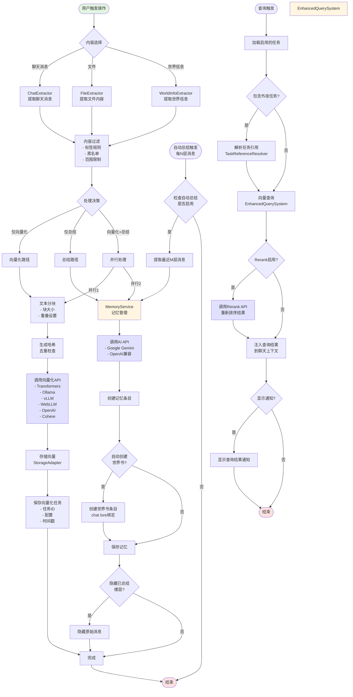

# 内容处理流程图

## 流程说明

### 1. 内容提取阶段
- 用户可选择聊天消息、文件或世界信息
- 每种内容类型有专门的提取器处理
- 所有内容都经过统一的过滤处理

### 2. 处理决策
系统根据用户选择决定处理路径：
- **仅向量化**：用于构建可搜索的知识库
- **仅总结**：用于生成记忆和压缩内容
- **并行处理**：同时进行向量化和总结

### 3. 向量化流程
1. 文本分块（根据chunk_size和overlap设置）
2. 生成哈希值用于去重
3. 调用选定的向量化API
4. 存储向量数据
5. 保存任务配置

### 4. 总结流程
1. MemoryService处理内容
2. 调用AI API生成总结
3. 可选创建世界书条目
4. 保存记忆
5. 可选隐藏已总结的消息

### 5. 自动总结
- 独立的触发机制
- 每N层消息自动触发
- 使用相同的总结流程

### 6. 查询使用
1. 加载所有启用的任务
2. 解析外挂任务引用
3. 执行向量查询
4. 可选Rerank重排序
5. 注入结果到聊天上下文
6. 可选显示通知

## 关键特性

- **并行处理**：向量化和总结可以同时进行，提高效率
- **模块化设计**：每个阶段都是独立模块，便于维护和扩展
- **灵活配置**：用户可以选择性地启用各个功能
- **外挂任务**：支持跨聊天共享向量化数据
- **自动化**：支持自动总结和自动隐藏功能