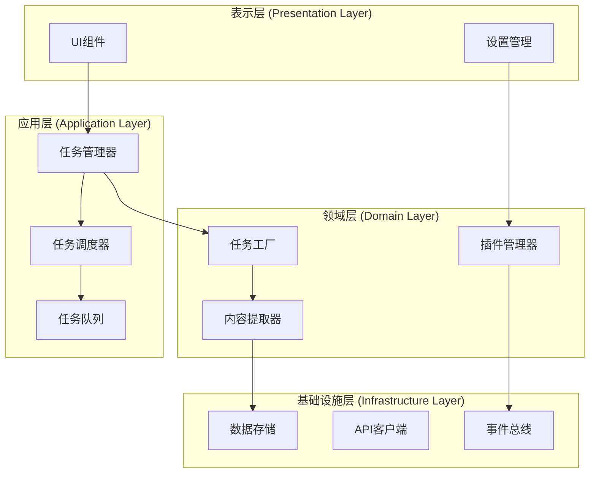
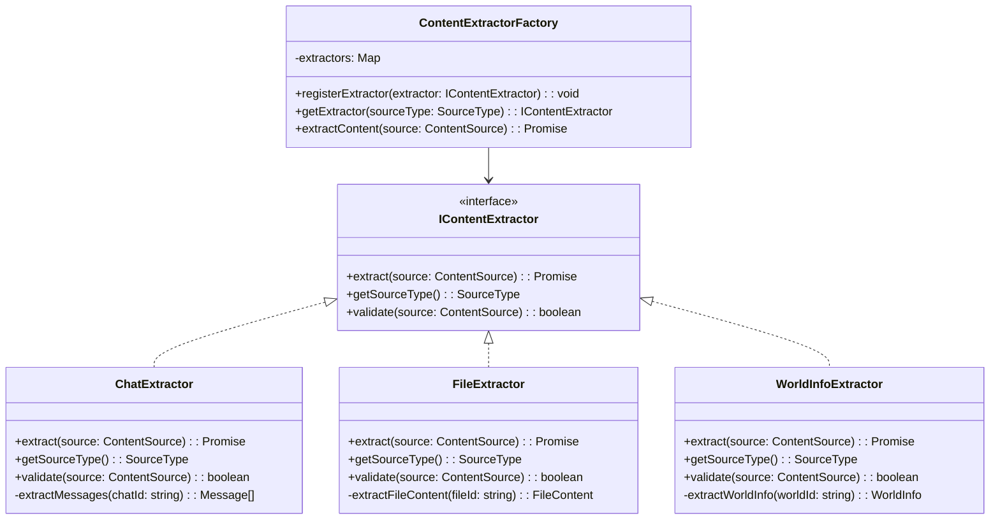
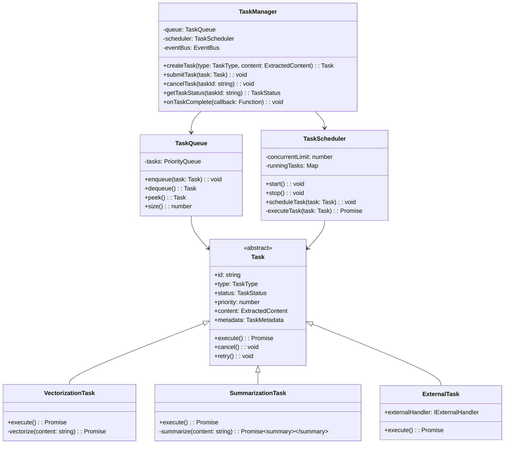
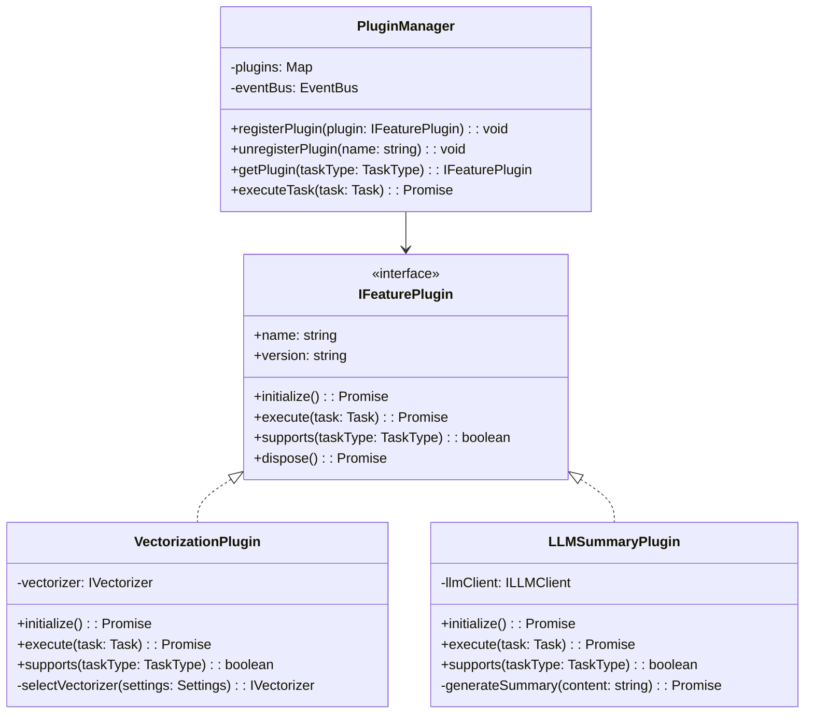
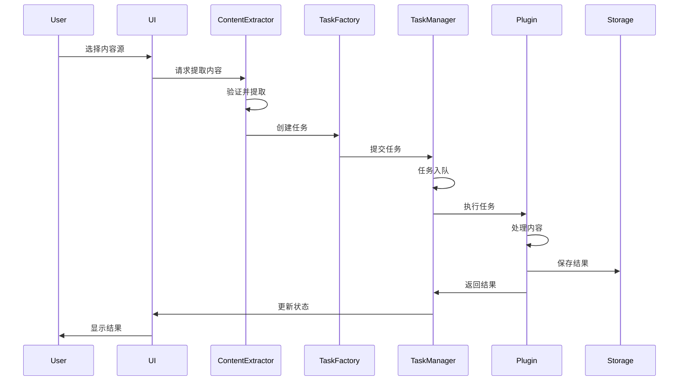

# Vectors Enhanced 重构架构设计

## 1. 架构概述

基于"内容提取→任务管理→功能实现"的核心理念，采用**分层架构 + 插件式架构**的混合模式。



## 2. 核心组件设计

### 2.1 内容提取层 (Content Extraction Layer)



**优势**：
- 易于添加新的内容源（只需实现 `IContentExtractor` 接口）
- 每个提取器独立，职责单一
- 工厂模式统一管理，降低耦合

### 2.2 任务管理层 (Task Management Layer)



**优势**：
- 任务类型可扩展（继承 `Task` 基类）
- 支持任务优先级和并发控制
- 支持外部任务挂载
- 任务状态可追踪

### 2.3 功能实现层 (Feature Implementation Layer)



## 3. 数据流设计



## 4. 关键设计模式应用

### 4.1 策略模式 (Strategy Pattern)
用于内容提取器和向量化器的选择：

```javascript
class VectorizationStrategy {
    constructor(vectorizer) {
        this.vectorizer = vectorizer;
    }
    
    async vectorize(content) {
        return await this.vectorizer.embed(content);
    }
}

// 使用
const strategy = new VectorizationStrategy(new WebLLMVectorizer());
const vectors = await strategy.vectorize(content);
```

### 4.2 观察者模式 (Observer Pattern)
用于任务状态通知：

```javascript
class TaskEventEmitter extends EventEmitter {
    notifyTaskStart(task) {
        this.emit('task:start', task);
    }
    
    notifyTaskComplete(task, result) {
        this.emit('task:complete', { task, result });
    }
    
    notifyTaskError(task, error) {
        this.emit('task:error', { task, error });
    }
}
```

### 4.3 工厂模式 (Factory Pattern)
用于创建任务和提取器：

```javascript
class TaskFactory {
    static createTask(type, content, options = {}) {
        switch(type) {
            case 'vectorization':
                return new VectorizationTask(content, options);
            case 'summarization':
                return new SummarizationTask(content, options);
            case 'external':
                return new ExternalTask(content, options);
            default:
                throw new Error(`Unknown task type: ${type}`);
        }
    }
}
```

## 5. 文件结构建议

```
vectors-enhanced/
├── src/
│   ├── core/                    # 核心领域逻辑
│   │   ├── entities/           # 实体类
│   │   │   ├── Task.js
│   │   │   ├── Content.js
│   │   │   └── Vector.js
│   │   ├── extractors/         # 内容提取器
│   │   │   ├── IContentExtractor.js
│   │   │   ├── ChatExtractor.js
│   │   │   ├── FileExtractor.js
│   │   │   └── WorldInfoExtractor.js
│   │   └── tasks/              # 任务实现
│   │       ├── VectorizationTask.js
│   │       ├── SummarizationTask.js
│   │       └── ExternalTask.js
│   ├── application/            # 应用层服务
│   │   ├── TaskManager.js
│   │   ├── TaskQueue.js
│   │   ├── TaskScheduler.js
│   │   └── PluginManager.js
│   ├── infrastructure/         # 基础设施
│   │   ├── storage/
│   │   │   ├── VectorStorage.js
│   │   │   └── TaskStorage.js
│   │   ├── api/
│   │   │   ├── WebLLMClient.js
│   │   │   ├── OllamaClient.js
│   │   │   └── TransformersClient.js
│   │   └── events/
│   │       └── EventBus.js
│   ├── plugins/                # 功能插件
│   │   ├── vectorization/
│   │   │   └── VectorizationPlugin.js
│   │   └── summarization/
│   │       └── LLMSummaryPlugin.js
│   ├── ui/                     # UI组件
│   │   ├── components/
│   │   ├── settings/
│   │   └── styles/
│   └── index.js                # 入口文件
├── tests/                      # 测试文件
├── docs/                       # 文档
└── manifest.json
```

## 6. 重构优先级建议

基于审查结果，建议按以下顺序进行重构：

### 第一阶段：核心架构搭建
1. **创建基础架构**
   - 实现 EventBus 事件总线
   - 实现基础的存储接口
   - 创建核心实体类（Task, Content, Vector）

2. **实现内容提取层**
   - 定义 IContentExtractor 接口
   - 实现 ChatExtractor
   - 创建 ContentExtractorFactory

### 第二阶段：任务管理系统
1. **实现任务管理**
   - 创建 TaskManager
   - 实现 TaskQueue（优先级队列）
   - 实现 TaskScheduler（并发控制）

2. **创建基础任务类型**
   - 实现 VectorizationTask
   - 预留 SummarizationTask 接口

### 第三阶段：功能插件化
1. **插件系统**
   - 定义 IFeaturePlugin 接口
   - 实现 PluginManager
   - 迁移现有向量化功能为插件

2. **UI重构**
   - 将 settings.html 拆分为组件
   - 实现响应式的任务状态显示
   - 优化样式系统

### 第四阶段：优化与扩展
1. **性能优化**
   - 实现任务结果缓存
   - 优化大文本处理
   - 添加任务批处理支持

2. **功能扩展**
   - 实现 LLM 总结插件
   - 支持外部任务挂载
   - 添加任务导入/导出功能

## 7. 架构优势总结

1. **高内聚低耦合**：每层职责明确，依赖关系清晰
2. **易于扩展**：通过接口和插件机制，新功能添加简单
3. **可维护性强**：模块化设计，代码组织清晰
4. **性能优化友好**：任务队列和调度器便于实现各种优化策略
5. **测试友好**：接口驱动设计，易于单元测试和集成测试

这种架构完美契合您的"内容提取→任务管理→功能实现"理念，同时为未来的功能扩展预留了充分的空间。
