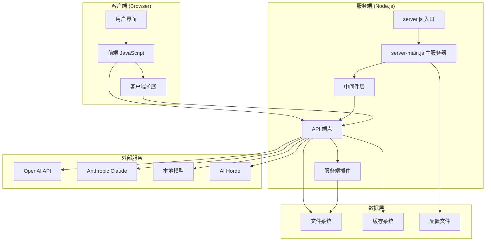
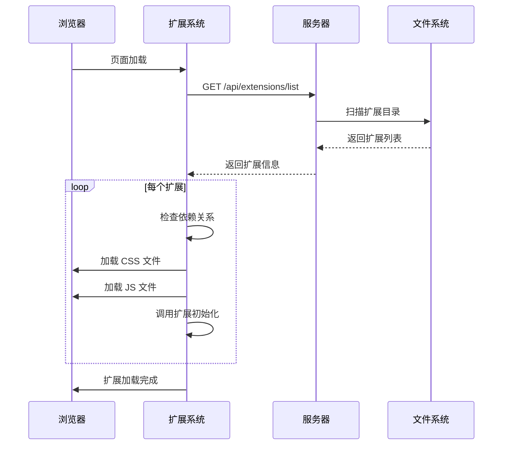
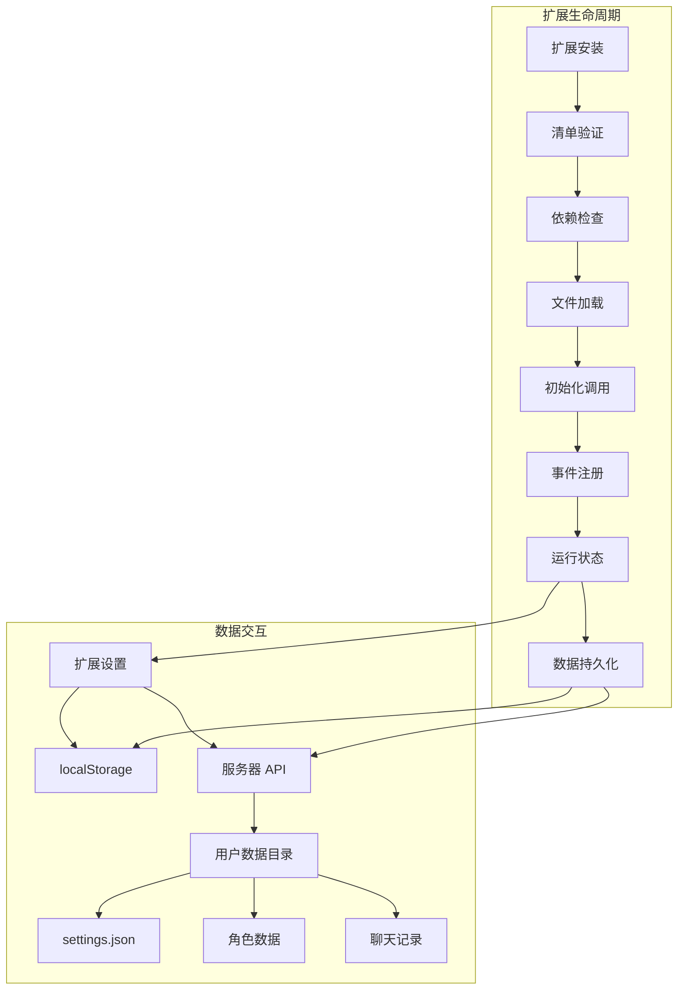
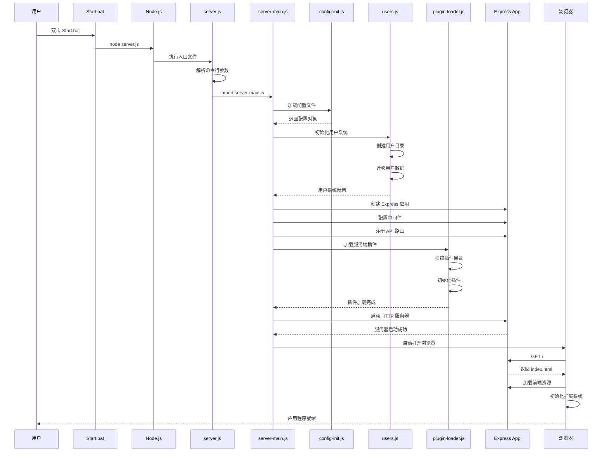
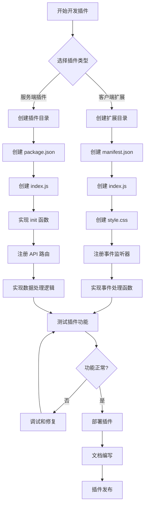
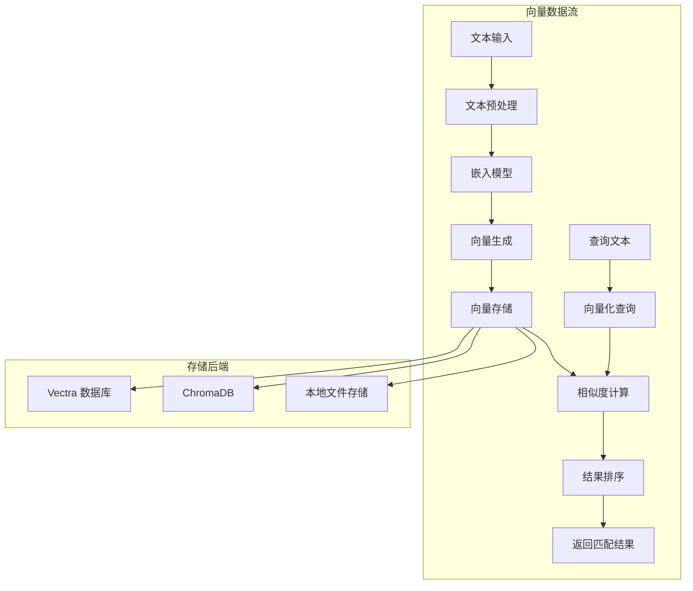
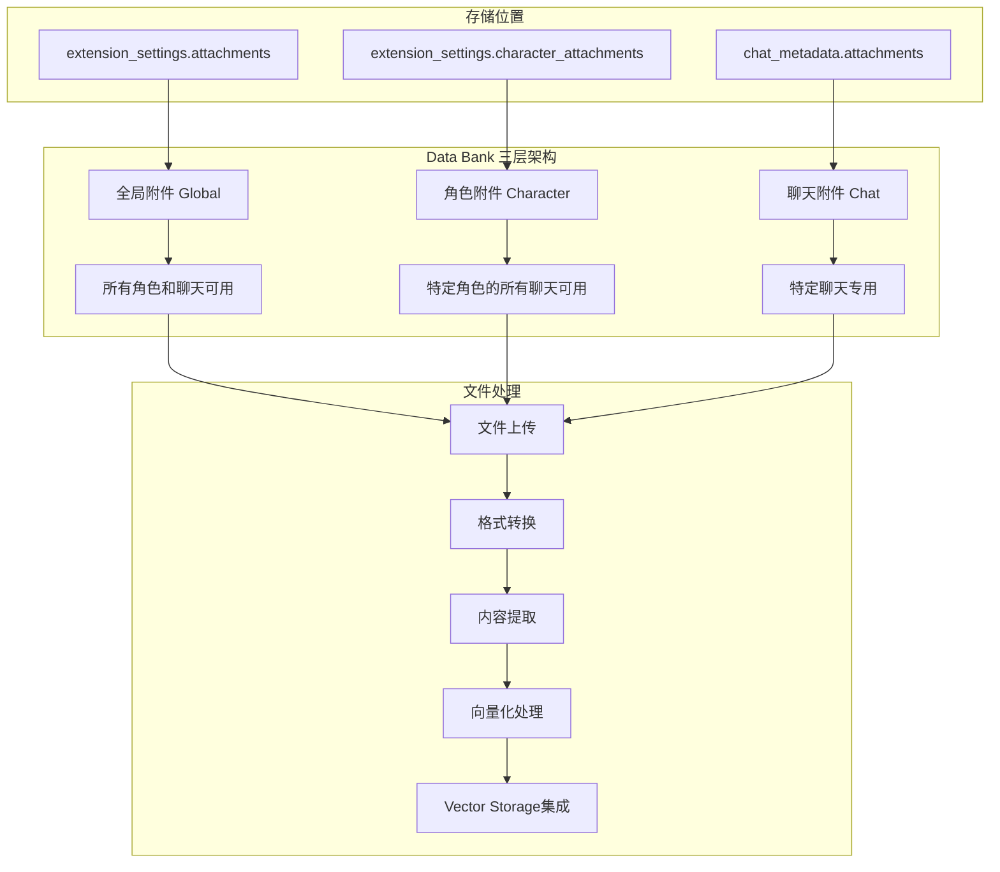
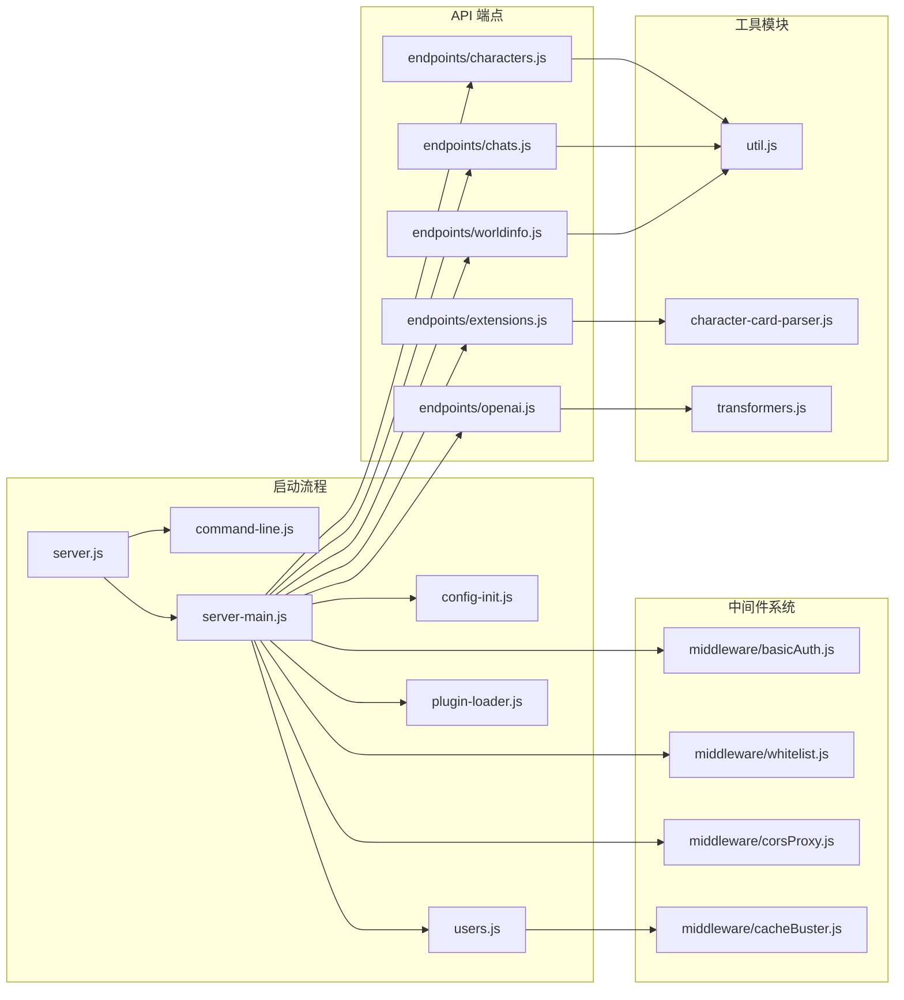
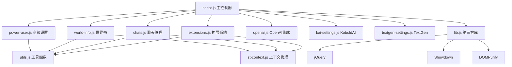

# SillyTavern 架构与开发文档


SillyTavern 是一个强大的 AI 聊天应用程序，基于 Node.js 和 Express 框架构建，支持多用户系统和丰富的插件扩展功能。

## 项目架构概览

### 核心技术栈
- **后端**: Node.js (ES Modules) + Express.js
- **前端**: 原生 JavaScript + jQuery
- **数据存储**: 文件系统 + JSON 格式
- **插件系统**: 动态模块加载
- **用户管理**: 基于会话的多用户系统
- **构建工具**: Webpack
- **版本要求**: Node.js >= 18

### 核心依赖分析

#### 后端核心依赖
```javascript
// Web 框架和中间件
"express": "^4.21.0",           // Web 应用框架
"cors": "^2.8.5",               // 跨域资源共享
"compression": "^1.8.0",        // HTTP 压缩
"helmet": "^8.1.0",             // 安全中间件
"csrf-sync": "^4.2.1",          // CSRF 保护
"cookie-session": "^2.1.0",     // 会话管理
"multer": "^2.0.1",             // 文件上传处理

// 配置和工具
"yaml": "^2.8.0",               // YAML 配置解析
"chalk": "^5.4.1",              // 终端颜色输出
"yargs": "^17.7.1",             // 命令行参数解析
"simple-git": "^3.28.0",        // Git 操作
"lodash": "^4.17.21",           // 工具函数库

// AI 和数据处理
"tiktoken": "^1.0.21",          // OpenAI 分词器
"vectra": "^0.2.2",             // 向量数据库
"sillytavern-transformers": "2.14.6", // AI 模型处理
"fuse.js": "^7.1.0",            // 模糊搜索

// 内容处理
"showdown": "^2.1.0",           // Markdown 解析
"handlebars": "^4.7.8",         // 模板引擎
"dompurify": "^3.2.6",          // HTML 净化
"@jimp/*": "^1.6.0",            // 图像处理套件
```

#### 前端库依赖
- **jQuery 3.5.1** - DOM 操作和事件处理
- **jQuery UI** - 用户界面组件和拖拽
- **Select2** - 高级选择框组件
- **Toastr** - 通知提示系统
- **Highlight.js** - 代码语法高亮
- **Showdown** - Markdown 渲染
- **DOMPurify** - XSS 防护
- **Popper.js** - 弹出层定位

### 主要功能特点
- 支持多种 AI 模型接入（OpenAI、Claude、本地模型等）
- 角色扮演和聊天功能
- 可扩展的插件系统（服务端插件 + 客户端扩展）
- 多用户支持和数据隔离
- 世界书（World Info）系统
- 聊天记录管理和备份
- 本地部署，保护隐私

## 系统架构流程图



## 项目目录结构详解

### 根目录结构
```
SillyTavern/
├── src/                    # 服务端源代码
├── public/                 # 前端静态资源
├── data/                   # 用户数据存储目录
├── plugins/                # 服务端插件目录
├── node_modules/           # Node.js 依赖
├── server.js              # 应用程序入口点
├── package.json           # 项目配置和依赖
└── config.yaml            # 服务器配置文件
```

### 核心目录详解

#### `/src` - 服务端核心代码
- `server-main.js` - 主服务器启动逻辑
- `plugin-loader.js` - 插件加载器
- `users.js` - 用户管理系统
- `endpoints/` - API 端点定义
  - `characters.js` - 角色管理 API
  - `chats.js` - 聊天记录 API
  - `worldinfo.js` - 世界书 API
  - `extensions.js` - 扩展管理 API
- `middleware/` - Express 中间件

#### `/public` - 前端资源
- `script.js` - 主要前端逻辑
- `scripts/` - 模块化 JavaScript 文件
  - `extensions.js` - 扩展系统前端逻辑
  - `chats.js` - 聊天界面逻辑
  - `characters.js` - 角色管理界面
- `css/` - 样式文件
- `lib/` - 第三方库

#### `/data` - 数据存储核心
这是整个应用程序的数据中心，采用多用户隔离设计：

```
data/
├── _storage/              # 用户账户信息存储
├── _cache/                # 系统缓存
├── _uploads/              # 临时上传文件
├── default-user/          # 默认用户数据目录
│   ├── characters/        # 角色卡存储 (.png 格式，包含 JSON 元数据)
│   ├── chats/            # 聊天记录 (.jsonl 格式)
│   ├── worlds/           # 世界书文件 (.json 格式)
│   ├── extensions/       # 用户扩展插件
│   ├── groups/           # 群组配置
│   ├── group chats/      # 群组聊天记录
│   ├── backgrounds/      # 背景图片
│   ├── User Avatars/     # 用户头像
│   ├── settings.json     # 用户设置
│   ├── secrets.json      # API 密钥等敏感信息
│   └── ...               # 其他用户数据
└── [other-users]/        # 其他用户的独立数据目录
```

## 安装要求

- Node.js 18 或更高版本
- 现代网页浏览器
- Git（用于插件自动更新）

## 快速开始

### Windows 用户
1. 下载并解压项目文件
2. 运行 `Start.bat` 文件
3. 等待浏览器自动打开应用程序

### Linux/Mac 用户
```bash
# 克隆仓库
git clone https://github.com/SillyTavern/SillyTavern.git
cd SillyTavern

# 安装依赖
npm install

# 启动服务器
npm start
```

## 插件系统架构详解

SillyTavern 采用双层插件架构：**服务端插件** 和 **客户端扩展**。

### 服务端插件系统

#### 插件加载机制
服务端插件由 `src/plugin-loader.js` 负责加载，支持以下格式：

1. **单文件插件**: 直接的 `.js`、`.cjs`、`.mjs` 文件
2. **目录插件**: 包含 `index.js` 的目录
3. **NPM 包插件**: 包含 `package.json` 的完整 NPM 包

#### 插件加载流程
```javascript
// 插件加载顺序
1. 扫描 /plugins 目录
2. 检查插件格式（文件/目录/NPM包）
3. 验证插件信息（id、name、description）
4. 调用插件的 init() 函数
5. 注册 API 路由到 /api/plugins/[plugin-id]
6. 存储插件实例到 loadedPlugins Map
```

#### 服务端插件结构
```javascript
// 标准服务端插件结构
export const info = {
    id: 'my-plugin',           // 唯一标识符
    name: '我的插件',           // 显示名称
    description: '插件描述'     // 功能描述
};

export async function init(router) {
    // 插件初始化逻辑
    // router 是 Express Router 实例
    router.get('/test', (req, res) => {
        res.json({ message: 'Hello from plugin!' });
    });
}

export async function exit() {
    // 插件清理逻辑（可选）
}
```

### 客户端扩展系统

#### 扩展存储位置
客户端扩展存储在用户数据目录中：
- **用户扩展**: `data/[user]/extensions/`
- **全局扩展**: `public/scripts/extensions/third-party/`
- **内置扩展**: `public/scripts/extensions/`

#### 扩展加载机制
扩展由 `public/scripts/extensions.js` 管理：

```javascript
// 扩展加载流程
1. 扫描扩展目录，读取 manifest.json
2. 按 loading_order 排序
3. 检查依赖关系
4. 加载 CSS 和 JavaScript 文件
5. 调用扩展的初始化函数
6. 注册到全局扩展列表
```

#### 扩展清单文件 (manifest.json)
```json
{
    "display_name": "扩展显示名称",
    "loading_order": 10,           // 加载顺序
    "requires": [],                // 必需依赖
    "optional": [],                // 可选依赖
    "js": "index.js",             // JavaScript 文件
    "css": "style.css",           // CSS 文件
    "author": "作者名",
    "version": "1.0.0",
    "auto_update": true,          // 是否自动更新
    "description": "扩展描述"
}
```

### 扩展系统工作流程

#### 扩展加载流程图


#### 扩展数据流图


### 插件管理命令
```bash
# 更新所有插件
npm run plugins:update

# 安装新插件
npm run plugins:install

# 启用/禁用插件（通过 Web 界面）
# 访问 设置 -> 扩展 -> 管理扩展
```

## 数据存储与访问机制

### 数据类型和存储格式

#### 1. 角色卡 (Characters)
- **存储位置**: `data/[user]/characters/`
- **文件格式**: PNG 图片文件，JSON 数据嵌入在图片元数据中
- **数据结构**:
```javascript
{
    name: "角色名称",
    description: "角色描述",
    personality: "性格特征",
    scenario: "场景设定",
    first_mes: "第一条消息",
    mes_example: "对话示例",
    tags: ["标签1", "标签2"],
    creator: "创建者",
    character_book: {}, // 角色专属世界书
    extensions: {}      // 扩展数据
}
```

#### 2. 聊天记录 (Chats)
- **存储位置**: `data/[user]/chats/`
- **文件格式**: JSONL (每行一个 JSON 对象)
- **文件命名**: `[角色名]_[时间戳].jsonl`
- **消息结构**:
```javascript
{
    name: "发送者名称",
    is_user: false,
    is_system: false,
    send_date: 1640995200000,
    mes: "消息内容",
    extra: {
        // 扩展数据，如图片、附件等
    }
}
```

#### 3. 世界书 (World Info)
- **存储位置**: `data/[user]/worlds/`
- **文件格式**: JSON
- **数据结构**:
```javascript
{
    entries: {
        "entry_id": {
            keys: ["关键词1", "关键词2"],
            content: "世界书条目内容",
            enabled: true,
            order: 100,
            position: "before_char"
        }
    }
}
```

#### 4. 用户设置
- **存储位置**: `data/[user]/settings.json`
- **包含内容**: UI 设置、API 配置、扩展设置等

### 插件如何访问系统数据

#### 服务端插件数据访问

服务端插件通过 Express 中间件获取用户数据：

```javascript
export async function init(router) {
    // 获取用户聊天记录
    router.get('/chats', (req, res) => {
        const userDirectories = req.user.directories;
        const chatsPath = userDirectories.chats;
        // 读取聊天文件...
    });

    // 获取角色数据
    router.get('/characters', (req, res) => {
        const charactersPath = req.user.directories.characters;
        // 读取角色文件...
    });

    // 获取世界书数据
    router.get('/worldinfo/:name', (req, res) => {
        const worldsPath = req.user.directories.worlds;
        const worldFile = path.join(worldsPath, `${req.params.name}.json`);
        // 读取世界书文件...
    });
}
```

#### 客户端扩展数据访问

客户端扩展通过全局 JavaScript 对象和 API 调用访问数据：

```javascript
// 访问当前聊天数据
import { chat, characters, this_chid } from '../script.js';

// 获取当前角色
const currentCharacter = characters[this_chid];

// 获取聊天记录
const chatHistory = chat;

// 访问扩展设置
import { extension_settings } from './extensions.js';
const mySettings = extension_settings.my_extension || {};

// 保存扩展数据到角色
function saveToCharacter(key, value) {
    const character = characters[this_chid];
    if (!character.data) character.data = {};
    if (!character.data.extensions) character.data.extensions = {};
    character.data.extensions[key] = value;

    // 发送到服务器保存
    fetch('/api/characters/merge-attributes', {
        method: 'POST',
        headers: getRequestHeaders(),
        body: JSON.stringify({
            avatar: character.avatar,
            data: { extensions: { [key]: value } }
        })
    });
}
```

### 常用 API 端点

#### 角色管理
- `GET /api/characters/all` - 获取所有角色
- `POST /api/characters/create` - 创建新角色
- `POST /api/characters/edit` - 编辑角色
- `POST /api/characters/merge-attributes` - 合并角色属性

#### 聊天管理
- `GET /api/chats/get` - 获取聊天记录
- `POST /api/chats/save` - 保存聊天记录
- `POST /api/chats/delete` - 删除聊天记录

#### 世界书管理
- `GET /api/worldinfo/get` - 获取世界书
- `POST /api/worldinfo/edit` - 编辑世界书
- `POST /api/worldinfo/import` - 导入世界书

## SillyTavern 启动流程详解

### 完整启动序列图


### 关键启动步骤分析

1. **命令行解析** (`server.js`)
   - 解析启动参数 (端口、数据目录等)
   - 设置全局变量
   - 切换工作目录

2. **配置初始化** (`config-init.js`)
   - 读取 `config.yaml`
   - 处理环境变量覆盖
   - 配置迁移和向后兼容

3. **用户系统初始化** (`users.js`)
   - 创建用户数据目录结构
   - 数据迁移和升级
   - 会话管理设置

4. **Express 应用配置** (`server-main.js`)
   - 安全中间件配置
   - 静态文件服务
   - API 路由注册

5. **插件系统启动** (`plugin-loader.js`)
   - 扫描插件目录
   - 验证插件格式
   - 初始化插件实例

6. **服务器启动**
   - HTTP/HTTPS 服务器启动
   - WebSocket 连接建立
   - 浏览器自动打开

## 开发指南

### 开发环境设置
1. 克隆仓库：`git clone https://github.com/SillyTavern/SillyTavern.git`
2. 安装依赖：`npm install`
3. 启动开发服务器：`npm start`
4. 调试模式：`npm run debug`
5. 代码检查：`npm run lint`

### 创建自定义插件

#### 服务端插件开发
1. 在 `plugins/` 目录创建插件文件夹
2. 创建 `index.js` 和 `package.json`
3. 实现插件接口
4. 重启服务器加载插件

#### 客户端扩展开发
1. 在 `data/[user]/extensions/` 创建扩展文件夹
2. 创建 `manifest.json`、`index.js`、`style.css`
3. 在 Web 界面启用扩展

## 插件开发完整指南

### 插件开发流程图



### 插件开发最佳实践

#### 1. 事件监听优先级
- **makeFirst()** - 需要最先处理的事件
- **on()** - 普通优先级事件处理
- **makeLast()** - 需要最后处理的事件

#### 2. 数据访问安全
- 始终检查数据是否存在
- 使用 try-catch 包装异步操作
- 避免直接修改全局对象

#### 3. 性能优化
- 使用防抖处理频繁事件
- 缓存计算结果
- 避免在事件处理中执行重操作

### SillyTavern 事件系统

#### 核心事件类型
```javascript
export const event_types = {
    // 消息相关事件
    MESSAGE_SENT: 'message_sent',                    // 消息发送后
    MESSAGE_RECEIVED: 'message_received',            // AI消息接收后
    USER_MESSAGE_RENDERED: 'user_message_rendered', // 用户消息渲染完成
    CHARACTER_MESSAGE_RENDERED: 'character_message_rendered', // AI消息渲染完成
    MESSAGE_UPDATED: 'message_updated',              // 消息更新
    MESSAGE_DELETED: 'message_deleted',              // 消息删除
    MESSAGE_SWIPED: 'message_swiped',               // 消息滑动切换

    // 生成相关事件
    GENERATION_AFTER_COMMANDS: 'GENERATION_AFTER_COMMANDS', // 生成前处理 (关键时机)
    GENERATION_STARTED: 'generation_started',        // 生成开始
    GENERATION_STOPPED: 'generation_stopped',        // 生成停止
    GENERATION_ENDED: 'generation_ended',            // 生成结束

    // 聊天相关事件
    CHAT_CHANGED: 'chat_id_changed',                 // 聊天切换
    CHAT_CREATED: 'chat_created',                    // 新聊天创建

    // 应用相关事件
    APP_READY: 'app_ready',                          // 应用就绪
    SETTINGS_LOADED_AFTER: 'settings_loaded_after'   // 设置加载完成
};
```

#### 事件监听方法
```javascript
import { eventSource, event_types } from '../script.js';

// 基本事件监听
eventSource.on(event_types.MESSAGE_SENT, (messageId) => {
    console.log('消息已发送:', messageId);
});

// 优先级监听 (最先执行)
eventSource.makeFirst(event_types.USER_MESSAGE_RENDERED, (messageId) => {
    console.log('用户消息渲染完成:', messageId);
});

// 最后执行的监听
eventSource.makeLast(event_types.CHARACTER_MESSAGE_RENDERED, (messageId) => {
    console.log('角色消息渲染完成:', messageId);
});
```

### 监听聊天发送事件

#### 关键事件时机
1. **MESSAGE_SENT** - 用户点击发送按钮后立即触发
2. **GENERATION_AFTER_COMMANDS** - AI生成前的最佳数据注入时机
3. **MESSAGE_RECEIVED** - AI回复接收后触发
4. **USER_MESSAGE_RENDERED** - 用户消息在界面显示完成后

#### 完整监听示例
```javascript
function registerEventListeners() {
    // 1. 监听用户消息发送 (发送按钮点击后)
    eventSource.on(event_types.MESSAGE_SENT, handleMessageSent);

    // 2. 监听AI生成开始前 (最佳注入时机)
    eventSource.on(event_types.GENERATION_AFTER_COMMANDS, handleGenerationAfterCommands);

    // 3. 监听AI消息接收
    eventSource.on(event_types.MESSAGE_RECEIVED, handleMessageReceived);

    // 4. 监听聊天切换
    eventSource.on(event_types.CHAT_CHANGED, handleChatChanged);
}

// 处理消息发送事件
async function handleMessageSent(messageId) {
    const message = context.chat[messageId];
    console.log('用户发送了消息:', message);
    // 在这里处理用户刚发送的消息
}

// 处理生成前事件 (关键时机)
async function handleGenerationAfterCommands(type, params, dryRun) {
    if (dryRun) return; // 跳过干运行

    console.log('AI生成即将开始:', { type, params });
    // 这是插入数据的最佳时机
    await performDataInjection();
}
```

### 获取聊天记录数据

#### 前端数据访问方法
```javascript
import { getContext } from '../scripts/st-context.js';
import { chat, characters, this_chid } from '../script.js';

// 方法1: 通过全局变量直接访问
function getChatData() {
    return {
        currentChat: chat,                    // 当前聊天记录数组
        currentCharacter: characters[this_chid], // 当前角色数据
        characterId: this_chid,               // 当前角色ID
        chatLength: chat.length               // 聊天消息数量
    };
}

// 方法2: 通过上下文获取
function getChatDataFromContext() {
    const context = getContext();
    return {
        chat: context.chat,
        characters: context.characters,
        characterId: context.characterId,
        groupId: context.groupId,
        chatId: context.chatId
    };
}

// 获取最近的N条消息
function getRecentMessages(count = 10) {
    const context = getContext();
    return context.chat.slice(-count);
}

// 按类型筛选消息
function filterMessagesByType(messages, types = ['user', 'assistant']) {
    return messages.filter(msg => {
        if (types.includes('user') && msg.is_user) return true;
        if (types.includes('assistant') && !msg.is_user && !msg.is_system) return true;
        if (types.includes('system') && msg.is_system) return true;
        return false;
    });
}
```

#### 聊天记录数据结构
```javascript
// 单条消息的数据结构
const messageStructure = {
    name: "发送者名称",           // 用户名或角色名
    is_user: false,             // 是否为用户消息
    is_system: false,           // 是否为系统消息
    send_date: 1640995200000,   // 发送时间戳
    mes: "消息内容",            // 消息文本
    swipe_id: 0,               // 滑动选择ID
    swipes: ["消息内容"],       // 所有滑动选项
    extra: {                   // 扩展数据
        api: "openai",         // 使用的API
        model: "gpt-4",        // 使用的模型
        image: "图片URL",       // 附加图片
        file: "文件信息",       // 附加文件
        // 插件可以在这里存储自定义数据
        my_plugin_data: {}
    }
};
```

### 插件数据库操作

#### 客户端扩展的数据持久化
```javascript
// 1. 保存到扩展设置
import { extension_settings, saveSettingsDebounced } from '../extensions.js';

function savePluginData(key, data) {
    if (!extension_settings.my_plugin) {
        extension_settings.my_plugin = {};
    }
    extension_settings.my_plugin[key] = data;
    saveSettingsDebounced();
}

function loadPluginData(key, defaultValue = null) {
    return extension_settings.my_plugin?.[key] ?? defaultValue;
}

// 2. 保存到角色数据
function saveToCharacter(key, value) {
    const context = getContext();
    const character = context.characters[context.characterId];

    if (!character.data) character.data = {};
    if (!character.data.extensions) character.data.extensions = {};
    if (!character.data.extensions.my_plugin) character.data.extensions.my_plugin = {};

    character.data.extensions.my_plugin[key] = value;

    // 发送到服务器保存
    fetch('/api/characters/merge-attributes', {
        method: 'POST',
        headers: getRequestHeaders(),
        body: JSON.stringify({
            avatar: character.avatar,
            data: {
                extensions: {
                    my_plugin: { [key]: value }
                }
            }
        })
    });
}

// 3. 保存到聊天元数据
import { chat_metadata, saveChatDebounced } from '../script.js';

function saveToChatMetadata(key, value) {
    if (!chat_metadata.extensions) chat_metadata.extensions = {};
    if (!chat_metadata.extensions.my_plugin) chat_metadata.extensions.my_plugin = {};

    chat_metadata.extensions.my_plugin[key] = value;
    saveChatDebounced();
}
```

### 向量数据库操作

#### SillyTavern 向量系统架构

SillyTavern 内置了强大的向量数据库系统，支持文本嵌入、相似度搜索和智能内容检索。



#### 向量API端点

```javascript
// 1. 向量查询 API
const queryVectors = async (text, options = {}) => {
    const response = await fetch('/api/vectors/query', {
        method: 'POST',
        headers: { 'Content-Type': 'application/json' },
        body: JSON.stringify({
            text: text,
            source: options.source || 'chat',        // 数据源: chat, files, characters
            top_k: options.topK || 10,               // 返回结果数量
            threshold: options.threshold || 0.7,     // 相似度阈值
            include_metadata: options.metadata || true
        })
    });
    return await response.json();
};

// 2. 向量插入 API
const insertVectors = async (chunks, source = 'chat') => {
    const response = await fetch('/api/vectors/insert', {
        method: 'POST',
        headers: { 'Content-Type': 'application/json' },
        body: JSON.stringify({
            source: source,
            chunks: chunks.map(chunk => ({
                text: chunk.text,
                metadata: {
                    timestamp: Date.now(),
                    messageId: chunk.messageId,
                    characterName: chunk.characterName,
                    ...chunk.metadata
                }
            }))
        })
    });
    return await response.json();
};

// 3. 向量删除 API
const deleteVectors = async (source, filter = {}) => {
    const response = await fetch('/api/vectors/delete', {
        method: 'POST',
        headers: { 'Content-Type': 'application/json' },
        body: JSON.stringify({
            source: source,
            filter: filter  // 删除条件，如 { messageId: 123 }
        })
    });
    return await response.json();
};

// 4. 获取向量集合信息
const getCollectionInfo = async (source) => {
    const response = await fetch(`/api/vectors/collections/${source}`);
    return await response.json();
};
```

#### 聊天记录向量化

```javascript
// 自动向量化聊天记录
async function vectorizeChatMessages(messages, options = {}) {
    const {
        chunkSize = 512,
        overlap = 50,
        includeUserMessages = true,
        includeAIMessages = true,
        includeSystemMessages = false
    } = options;

    // 筛选消息类型
    const filteredMessages = messages.filter(msg => {
        if (includeUserMessages && msg.is_user) return true;
        if (includeAIMessages && !msg.is_user && !msg.is_system) return true;
        if (includeSystemMessages && msg.is_system) return true;
        return false;
    });

    // 文本分块
    const chunks = [];
    for (const message of filteredMessages) {
        const text = message.mes || '';
        if (text.length < 10) continue; // 跳过太短的消息

        // 简单分块（可以使用更复杂的分块算法）
        if (text.length <= chunkSize) {
            chunks.push({
                text: text,
                messageId: message.id || filteredMessages.indexOf(message),
                characterName: message.name,
                isUser: message.is_user,
                timestamp: message.send_date,
                metadata: {
                    swipeId: message.swipe_id,
                    extra: message.extra
                }
            });
        } else {
            // 长文本分块
            for (let i = 0; i < text.length; i += chunkSize - overlap) {
                const chunk = text.slice(i, i + chunkSize);
                chunks.push({
                    text: chunk,
                    messageId: message.id || filteredMessages.indexOf(message),
                    characterName: message.name,
                    isUser: message.is_user,
                    timestamp: message.send_date,
                    chunkIndex: Math.floor(i / (chunkSize - overlap)),
                    metadata: {
                        isPartial: true,
                        originalLength: text.length,
                        swipeId: message.swipe_id,
                        extra: message.extra
                    }
                });
            }
        }
    }

    // 批量插入向量数据库
    if (chunks.length > 0) {
        const result = await insertVectors(chunks, 'chat');
        console.log(`向量化完成: ${chunks.length} 个文本块`);
        return result;
    }

    return { success: true, count: 0 };
}
```

#### 智能向量查询和注入

```javascript
// 智能向量查询插件示例
class VectorQueryPlugin {
    constructor() {
        this.settings = {
            enabled: true,
            queryMessageCount: 5,      // 查询时使用的最近消息数量
            maxResults: 10,            // 最大返回结果数
            scoreThreshold: 0.7,       // 相似度阈值
            injectionTemplate: '相关内容：\n{{results}}',
            injectionDepth: 1,         // 注入深度
            rerank: {
                enabled: false,
                model: 'rerank-multilingual-v2.0',
                topN: 5
            }
        };
    }

    // 注册事件监听器
    registerEvents() {
        eventSource.on(event_types.GENERATION_AFTER_COMMANDS,
            this.handleGenerationAfterCommands.bind(this));
    }

    // 在AI生成前进行向量查询和注入
    async handleGenerationAfterCommands(type, params, dryRun) {
        if (dryRun || !this.settings.enabled) return;

        try {
            // 1. 获取查询文本
            const queryText = await this.getQueryText();
            if (!queryText) return;

            // 2. 执行向量查询
            const results = await this.performVectorQuery(queryText);
            if (results.length === 0) return;

            // 3. 可选的重排序
            const finalResults = this.settings.rerank.enabled
                ? await this.rerankResults(queryText, results)
                : results;

            // 4. 注入到聊天上下文
            await this.injectResults(finalResults);

            console.log(`向量查询完成: 找到 ${finalResults.length} 个相关结果`);

        } catch (error) {
            console.error('向量查询失败:', error);
        }
    }

    // 获取查询文本
    async getQueryText() {
        const context = getContext();
        const recentMessages = context.chat.slice(-this.settings.queryMessageCount);

        // 提取用户和AI的消息文本
        const queryTexts = recentMessages
            .filter(msg => !msg.is_system)
            .map(msg => msg.mes)
            .filter(text => text && text.length > 0);

        return queryTexts.join('\n');
    }

    // 执行向量查询
    async performVectorQuery(queryText) {
        const results = await queryVectors(queryText, {
            source: 'chat',
            topK: this.settings.maxResults,
            threshold: this.settings.scoreThreshold,
            metadata: true
        });

        return results.matches || [];
    }

    // 重排序结果 (可选)
    async rerankResults(queryText, results) {
        if (!this.settings.rerank.enabled || results.length <= 1) {
            return results;
        }

        try {
            const response = await fetch('/api/vectors/rerank', {
                method: 'POST',
                headers: { 'Content-Type': 'application/json' },
                body: JSON.stringify({
                    query: queryText,
                    documents: results.map(r => r.text),
                    model: this.settings.rerank.model,
                    top_n: this.settings.rerank.topN
                })
            });

            const rerankResult = await response.json();

            // 根据重排序结果重新排列
            return rerankResult.results.map(item => results[item.index]);

        } catch (error) {
            console.warn('重排序失败，使用原始结果:', error);
            return results.slice(0, this.settings.rerank.topN);
        }
    }

    // 注入结果到聊天上下文
    async injectResults(results) {
        if (results.length === 0) return;

        // 格式化结果文本
        const formattedResults = results.map((result, index) => {
            const score = (result.score * 100).toFixed(1);
            const timestamp = result.metadata?.timestamp
                ? new Date(result.metadata.timestamp).toLocaleString()
                : '未知时间';

            return `[${index + 1}] (相似度: ${score}%, 时间: ${timestamp})\n${result.text}`;
        }).join('\n\n');

        // 应用注入模板
        const injectionText = this.settings.injectionTemplate
            .replace('{{results}}', formattedResults)
            .replace('{{count}}', results.length);

        // 注入到聊天上下文 (使用SillyTavern的扩展提示系统)
        const context = getContext();
        if (context.setExtensionPrompt) {
            context.setExtensionPrompt(
                'VECTOR_QUERY',           // 扩展标识
                injectionText,            // 注入内容
                1,                        // 位置 (1=在角色描述后)
                this.settings.injectionDepth, // 深度
                false,                    // 不包含在世界书中
                'system'                  // 角色类型
            );
        }
    }
}

// 使用示例
const vectorPlugin = new VectorQueryPlugin();
vectorPlugin.registerEvents();
```

#### 向量数据管理

```javascript
// 向量数据管理工具
class VectorDataManager {
    // 清理过期向量数据
    async cleanupOldVectors(daysOld = 30) {
        const cutoffDate = Date.now() - (daysOld * 24 * 60 * 60 * 1000);

        await deleteVectors('chat', {
            timestamp: { $lt: cutoffDate }
        });

        console.log(`清理了 ${daysOld} 天前的向量数据`);
    }

    // 重建向量索引
    async rebuildVectorIndex(source = 'chat') {
        // 1. 删除现有向量
        await deleteVectors(source);

        // 2. 重新向量化数据
        const context = getContext();
        if (source === 'chat') {
            await vectorizeChatMessages(context.chat);
        }

        console.log(`重建了 ${source} 的向量索引`);
    }

    // 获取向量统计信息
    async getVectorStats() {
        const collections = ['chat', 'files', 'characters'];
        const stats = {};

        for (const collection of collections) {
            try {
                const info = await getCollectionInfo(collection);
                stats[collection] = {
                    count: info.count || 0,
                    size: info.size || 0,
                    lastUpdated: info.lastUpdated
                };
            } catch (error) {
                stats[collection] = { error: error.message };
            }
        }

        return stats;
    }
}
```

### Data Bank (附件数据库) 系统

#### Data Bank 架构概览

SillyTavern 的 Data Bank 是一个三层附件管理系统，为聊天提供文件附件支持和向量化搜索能力。



#### 支持的文件格式
- **纯文本** (.txt) - 直接文本内容
- **PDF** (.pdf) - 自动提取文本内容
- **Markdown** (.md) - 支持格式化文本
- **HTML** (.html) - 网页内容提取
- **EPUB** (.epub) - 电子书格式支持

#### Data Bank API 接口

```javascript
// 1. 获取所有附件
import { getDataBankAttachments, getDataBankAttachmentsForSource } from '../../chats.js';

// 获取所有可用附件（排除禁用的）
const allAttachments = getDataBankAttachments(false);

// 获取特定来源的附件
const globalAttachments = getDataBankAttachmentsForSource('global');
const characterAttachments = getDataBankAttachmentsForSource('character');
const chatAttachments = getDataBankAttachmentsForSource('chat');

// 2. 上传文件附件
import { uploadFileAttachmentToServer } from '../../chats.js';

async function uploadToDataBank(file, target = 'chat') {
    // target: 'global', 'character', 'chat'
    const fileUrl = await uploadFileAttachmentToServer(file, target);
    return fileUrl;
}

// 3. 获取附件内容
import { getFileAttachment } from '../../chats.js';

async function getAttachmentContent(attachmentUrl) {
    const content = await getFileAttachment(attachmentUrl);
    return content;
}

// 4. 删除附件
import { deleteAttachment } from '../../chats.js';

async function removeAttachment(attachment, source) {
    await deleteAttachment(attachment, source, () => {
        console.log('附件删除成功');
    }, false);
}
```

#### 附件数据结构

```javascript
// 附件对象结构
const attachmentStructure = {
    url: "files/uploads/document.pdf",    // 文件URL路径
    size: 1024000,                       // 文件大小（字节）
    name: "document.pdf",                // 文件名
    created: 1640995200000,              // 创建时间戳
    type: "application/pdf"              // MIME类型（可选）
};

// 三层存储结构
const storageStructure = {
    // 全局附件 - 存储在扩展设置中
    "extension_settings.attachments": [
        { url: "files/global/manual.pdf", name: "用户手册", size: 2048000, created: 1640995200000 }
    ],

    // 角色附件 - 按角色头像分组
    "extension_settings.character_attachments": {
        "character1.png": [
            { url: "files/character/background.txt", name: "角色背景", size: 1024, created: 1640995200000 }
        ]
    },

    // 聊天附件 - 存储在聊天元数据中
    "chat_metadata.attachments": [
        { url: "files/chat/notes.md", name: "聊天笔记", size: 512, created: 1640995200000 }
    ]
};
```

#### Slash Commands 支持

Data Bank 提供了丰富的斜杠命令支持：

```javascript
// 基本命令
/db                          // 打开 Data Bank 管理界面
/databank                    // 同上
/data-bank                   // 同上

// 文件操作命令
/db-add content="文本内容" name="文件名" source="global"    // 添加附件
/db-get name="文件名" source="chat"                      // 获取附件内容
/db-update name="文件名" content="新内容"                 // 更新附件
/db-delete name="文件名" source="character"              // 删除附件

// 附件管理命令
/db-list source="global"                                // 列出附件
/db-enable name="文件名"                                // 启用附件
/db-disable name="文件名"                               // 禁用附件
/db-move from="chat" to="global" name="文件名"          // 移动附件
```

#### 与 Vector Storage 集成

```javascript
// Data Bank 与向量存储的集成示例
class DataBankVectorIntegration {
    // 自动向量化新上传的附件
    async onAttachmentUploaded(attachment, source) {
        if (this.settings.autoVectorize) {
            const content = await getFileAttachment(attachment.url);

            // 向量化文件内容
            await this.vectorizeContent(content, {
                source: 'databank',
                metadata: {
                    filename: attachment.name,
                    source: source,
                    uploadTime: attachment.created,
                    fileSize: attachment.size
                }
            });
        }
    }

    // 基于附件内容进行智能检索
    async searchAttachments(query, options = {}) {
        const results = await queryVectors(query, {
            source: 'databank',
            topK: options.maxResults || 5,
            threshold: options.threshold || 0.7
        });

        // 返回匹配的附件信息
        return results.matches.map(match => ({
            attachment: this.findAttachmentByMetadata(match.metadata),
            score: match.score,
            content: match.text
        }));
    }

    // 智能内容推荐
    async recommendAttachments(currentContext) {
        const recommendations = await this.searchAttachments(currentContext, {
            maxResults: 3,
            threshold: 0.6
        });

        return recommendations.filter(rec => rec.score > 0.6);
    }
}
```

#### Data Bank 插件开发示例

```javascript
// 完整的 Data Bank 管理插件示例
class DataBankManager {
    constructor() {
        this.settings = {
            autoVectorize: true,
            maxFileSize: 10 * 1024 * 1024, // 10MB
            allowedTypes: ['text/plain', 'application/pdf', 'text/markdown'],
            defaultSource: 'chat'
        };

        this.registerEventListeners();
        this.registerSlashCommands();
    }

    // 注册事件监听器
    registerEventListeners() {
        // 监听文件上传事件
        eventSource.on('file_attachment_uploaded', this.onFileUploaded.bind(this));

        // 监听聊天切换事件
        eventSource.on(event_types.CHAT_CHANGED, this.onChatChanged.bind(this));

        // 监听角色切换事件
        eventSource.on('character_selected', this.onCharacterChanged.bind(this));
    }

    // 文件上传处理
    async onFileUploaded(fileData) {
        console.log('文件已上传到 Data Bank:', fileData);

        if (this.settings.autoVectorize) {
            await this.vectorizeAttachment(fileData);
        }

        // 更新UI显示
        this.updateAttachmentsList();
    }

    // 批量上传文件
    async uploadMultipleFiles(files, target = 'chat') {
        const results = [];

        for (const file of files) {
            try {
                // 检查文件大小和类型
                if (!this.validateFile(file)) {
                    console.warn(`跳过无效文件: ${file.name}`);
                    continue;
                }

                const fileUrl = await uploadFileAttachmentToServer(file, target);
                results.push({
                    success: true,
                    file: file.name,
                    url: fileUrl
                });

                console.log(`上传成功: ${file.name} -> ${fileUrl}`);

            } catch (error) {
                results.push({
                    success: false,
                    file: file.name,
                    error: error.message
                });

                console.error(`上传失败: ${file.name}`, error);
            }
        }

        return results;
    }

    // 文件验证
    validateFile(file) {
        // 检查文件大小
        if (file.size > this.settings.maxFileSize) {
            toastr.error(`文件 ${file.name} 超过大小限制 (${this.settings.maxFileSize / 1024 / 1024}MB)`);
            return false;
        }

        // 检查文件类型
        if (!this.settings.allowedTypes.includes(file.type)) {
            toastr.error(`不支持的文件类型: ${file.type}`);
            return false;
        }

        return true;
    }

    // 智能搜索附件
    async searchAttachments(query, options = {}) {
        const {
            source = 'all',
            includeContent = true,
            maxResults = 10
        } = options;

        let attachments;

        if (source === 'all') {
            attachments = getDataBankAttachments();
        } else {
            attachments = getDataBankAttachmentsForSource(source);
        }

        // 基于文件名的模糊搜索
        const nameMatches = attachments.filter(att =>
            att.name.toLowerCase().includes(query.toLowerCase())
        );

        // 如果启用内容搜索，则进行向量搜索
        let contentMatches = [];
        if (includeContent) {
            try {
                const vectorResults = await queryVectors(query, {
                    source: 'databank',
                    topK: maxResults,
                    threshold: 0.6
                });

                contentMatches = vectorResults.matches || [];
            } catch (error) {
                console.warn('向量搜索失败:', error);
            }
        }

        // 合并和排序结果
        return this.mergeSearchResults(nameMatches, contentMatches, maxResults);
    }

    // 附件内容预览
    async previewAttachment(attachment) {
        try {
            const content = await getFileAttachment(attachment.url);

            // 根据文件类型进行不同的预览处理
            let previewContent;

            if (attachment.name.endsWith('.md')) {
                // Markdown 渲染
                previewContent = this.renderMarkdown(content);
            } else if (attachment.name.endsWith('.html')) {
                // HTML 净化和预览
                previewContent = this.sanitizeHtml(content);
            } else {
                // 纯文本预览（限制长度）
                previewContent = content.length > 1000
                    ? content.substring(0, 1000) + '...'
                    : content;
            }

            return {
                name: attachment.name,
                size: attachment.size,
                created: new Date(attachment.created).toLocaleString(),
                content: previewContent,
                fullContent: content
            };

        } catch (error) {
            console.error('预览附件失败:', error);
            return null;
        }
    }

    // 附件统计信息
    getAttachmentStats() {
        const global = getDataBankAttachmentsForSource('global');
        const character = getDataBankAttachmentsForSource('character');
        const chat = getDataBankAttachmentsForSource('chat');

        return {
            global: {
                count: global.length,
                totalSize: global.reduce((sum, att) => sum + att.size, 0)
            },
            character: {
                count: character.length,
                totalSize: character.reduce((sum, att) => sum + att.size, 0)
            },
            chat: {
                count: chat.length,
                totalSize: chat.reduce((sum, att) => sum + att.size, 0)
            },
            total: {
                count: global.length + character.length + chat.length,
                totalSize: global.reduce((sum, att) => sum + att.size, 0) +
                          character.reduce((sum, att) => sum + att.size, 0) +
                          chat.reduce((sum, att) => sum + att.size, 0)
            }
        };
    }

    // 清理过期附件
    async cleanupOldAttachments(daysOld = 30) {
        const cutoffDate = Date.now() - (daysOld * 24 * 60 * 60 * 1000);
        const sources = ['global', 'character', 'chat'];
        let cleanedCount = 0;

        for (const source of sources) {
            const attachments = getDataBankAttachmentsForSource(source);
            const oldAttachments = attachments.filter(att => att.created < cutoffDate);

            for (const attachment of oldAttachments) {
                try {
                    await deleteAttachment(attachment, source, () => {}, false);
                    cleanedCount++;
                } catch (error) {
                    console.error(`删除附件失败: ${attachment.name}`, error);
                }
            }
        }

        console.log(`清理完成: 删除了 ${cleanedCount} 个过期附件`);
        return cleanedCount;
    }
}

// 使用示例
const dataBankManager = new DataBankManager();

// 上传文件
document.getElementById('fileInput').addEventListener('change', async (e) => {
    const files = Array.from(e.target.files);
    const results = await dataBankManager.uploadMultipleFiles(files, 'global');
    console.log('上传结果:', results);
});

// 搜索附件
const searchResults = await dataBankManager.searchAttachments('用户手册', {
    source: 'all',
    includeContent: true,
    maxResults: 5
});

// 获取统计信息
const stats = dataBankManager.getAttachmentStats();
console.log('附件统计:', stats);
```

#### Data Bank 最佳实践

1. **文件组织策略**
   - **全局附件**: 存放常用参考文档、系统手册
   - **角色附件**: 存放角色背景、设定文档
   - **聊天附件**: 存放临时文件、会话相关资料

2. **性能优化**
   - 定期清理过期附件
   - 限制单个文件大小
   - 使用向量化提高搜索效率

3. **安全考虑**
   - 验证文件类型和大小
   - 净化HTML内容
   - 限制文件访问权限

更多开发信息请参阅 [CONTRIBUTING.md](CONTRIBUTING.md)。

## 系统配置

### 主要配置文件
- `config.yaml` - 服务器主配置
- `data/[user]/settings.json` - 用户界面设置
- `data/[user]/secrets.json` - API 密钥等敏感信息

### 多用户系统
SillyTavern 支持多用户，每个用户拥有独立的数据空间：
- 用户数据完全隔离
- 独立的角色、聊天、设置
- 基于会话的身份验证
- 管理员可以管理所有用户

## 常见问题

### 如何更新 SillyTavern？
**Windows 用户**: 运行 `UpdateAndStart.bat`
**Linux/Mac 用户**:
```bash
git pull
npm install
```

### 如何备份数据？
所有用户数据存储在 `data/` 目录中，定期备份此目录即可。

### 如何安装第三方扩展？
1. 将扩展文件夹放入 `data/[user]/extensions/`
2. 在 Web 界面的 "设置 -> 扩展" 中启用
3. 刷新页面生效

### 如何开发自定义插件？

#### 服务端插件数据库访问
```javascript
// 服务端插件 plugins/my-plugin/index.js
import fs from 'node:fs';
import path from 'node:path';

export const info = {
    id: 'my-plugin',
    name: '我的插件',
    description: '插件描述'
};

export async function init(router) {
    // 获取聊天记录
    router.get('/chats/:characterName', (req, res) => {
        try {
            const characterName = req.params.characterName;
            const userDirectories = req.user.directories;
            const chatsPath = path.join(userDirectories.chats, characterName);

            if (!fs.existsSync(chatsPath)) {
                return res.json([]);
            }

            const chatFiles = fs.readdirSync(chatsPath)
                .filter(file => file.endsWith('.jsonl'))
                .map(file => {
                    const filePath = path.join(chatsPath, file);
                    const content = fs.readFileSync(filePath, 'utf8');
                    return content.split('\n')
                        .filter(line => line.trim())
                        .map(line => JSON.parse(line));
                });

            res.json(chatFiles);
        } catch (error) {
            console.error('获取聊天记录失败:', error);
            res.status(500).json({ error: error.message });
        }
    });

    // 保存插件数据
    router.post('/data/:key', (req, res) => {
        try {
            const key = req.params.key;
            const data = req.body;
            const userDataPath = req.user.directories.root;
            const pluginDataPath = path.join(userDataPath, 'my-plugin-data.json');

            let pluginData = {};
            if (fs.existsSync(pluginDataPath)) {
                pluginData = JSON.parse(fs.readFileSync(pluginDataPath, 'utf8'));
            }

            pluginData[key] = data;
            fs.writeFileSync(pluginDataPath, JSON.stringify(pluginData, null, 2));

            res.json({ success: true });
        } catch (error) {
            console.error('保存数据失败:', error);
            res.status(500).json({ error: error.message });
        }
    });
}
```

#### 完整客户端扩展示例
```javascript
// data/default-user/extensions/my-chat-plugin/index.js
import { getContext, eventSource, event_types, getRequestHeaders } from '../../../script.js';
import { extension_settings, saveSettingsDebounced } from '../../scripts/extensions.js';

const extensionName = 'my-chat-plugin';
let context;

// 默认设置
const defaultSettings = {
    enabled: true,
    logMessages: true,
    processOnSend: true,
    apiEndpoint: '/api/plugins/my-plugin'
};

// 初始化
jQuery(async () => {
    context = getContext();
    loadSettings();
    createUI();
    registerEventListeners();
    console.log(`${extensionName} 已加载`);
});

// 注册事件监听器
function registerEventListeners() {
    // 监听发送按钮点击
    eventSource.on(event_types.MESSAGE_SENT, onMessageSent);

    // 监听AI生成前
    eventSource.on(event_types.GENERATION_AFTER_COMMANDS, onGenerationAfterCommands);

    // 监听消息接收
    eventSource.on(event_types.MESSAGE_RECEIVED, onMessageReceived);

    // 监听聊天切换
    eventSource.on(event_types.CHAT_CHANGED, onChatChanged);
}

// 处理消息发送
async function onMessageSent(messageId) {
    if (!extension_settings[extensionName].enabled) return;

    const message = context.chat[messageId];
    console.log('用户发送消息:', message);

    if (extension_settings[extensionName].logMessages) {
        await logMessage('USER', message);
    }
}

// 处理生成前事件
async function onGenerationAfterCommands(type, params, dryRun) {
    if (dryRun || !extension_settings[extensionName].enabled) return;

    console.log('即将生成AI回复');

    // 在这里可以修改生成参数或注入数据
    if (extension_settings[extensionName].processOnSend) {
        await processBeforeGeneration();
    }
}

// 记录消息到服务器
async function logMessage(type, message) {
    try {
        const response = await fetch(`${extension_settings[extensionName].apiEndpoint}/log`, {
            method: 'POST',
            headers: getRequestHeaders(),
            body: JSON.stringify({
                type: type,
                message: message,
                timestamp: Date.now()
            })
        });

        if (!response.ok) {
            throw new Error(`HTTP ${response.status}`);
        }
    } catch (error) {
        console.error('记录消息失败:', error);
    }
}
```

#### 插件开发快速参考

| 功能需求 | 推荐事件 | 使用场景 |
|---------|---------|----------|
| 监听用户发送消息 | `MESSAGE_SENT` | 消息发送后立即处理 |
| 在AI生成前注入数据 | `GENERATION_AFTER_COMMANDS` | 修改生成参数、注入上下文 |
| 处理AI回复 | `MESSAGE_RECEIVED` | AI消息接收后处理 |
| 监听聊天切换 | `CHAT_CHANGED` | 聊天切换时的初始化 |
| 监听消息渲染 | `USER_MESSAGE_RENDERED` | UI更新后的处理 |
| 监听消息编辑 | `MESSAGE_UPDATED` | 消息修改后的处理 |

| 数据访问需求 | 方法 | 说明 |
|-------------|------|------|
| 获取当前聊天 | `getContext().chat` | 当前聊天记录数组 |
| 获取当前角色 | `characters[this_chid]` | 当前选中的角色数据 |
| 获取最近消息 | `chat.slice(-n)` | 获取最近n条消息 |
| 保存扩展设置 | `extension_settings` | 全局扩展设置 |
| 保存到角色 | `character.data.extensions` | 角色专属数据 |
| 保存到聊天 | `chat_metadata.extensions` | 聊天专属数据 |

| API端点 | 用途 | 示例 |
|---------|------|------|
| `/api/characters/*` | 角色管理 | 获取、创建、编辑角色 |
| `/api/chats/*` | 聊天管理 | 获取、保存聊天记录 |
| `/api/worldinfo/*` | 世界书管理 | 世界书CRUD操作 |
| `/api/vectors/*` | 向量数据库 | 向量查询、插入、删除 |
| `/api/plugins/[id]/*` | 插件API | 自定义插件端点 |

| 向量操作 | API端点 | 说明 |
|---------|---------|------|
| 向量查询 | `POST /api/vectors/query` | 相似度搜索和内容检索 |
| 向量插入 | `POST /api/vectors/insert` | 批量插入文本向量 |
| 向量删除 | `POST /api/vectors/delete` | 按条件删除向量数据 |
| 集合信息 | `GET /api/vectors/collections/{source}` | 获取向量集合统计 |
| 重排序 | `POST /api/vectors/rerank` | AI驱动的结果重排序 |

| Data Bank 操作 | 函数/命令 | 说明 |
|---------------|----------|------|
| 获取所有附件 | `getDataBankAttachments()` | 获取所有可用附件 |
| 按来源获取 | `getDataBankAttachmentsForSource(source)` | 获取特定来源的附件 |
| 上传附件 | `uploadFileAttachmentToServer(file, target)` | 上传文件到指定层级 |
| 获取内容 | `getFileAttachment(url)` | 获取附件文本内容 |
| 删除附件 | `deleteAttachment(attachment, source)` | 删除指定附件 |
| 斜杠命令 | `/db`, `/db-add`, `/db-get` | 命令行操作接口 |

参考上述完整示例，或查看现有插件代码作为参考。

### 插件无法加载怎么办？
1. 检查插件文件结构和 manifest.json
2. 查看浏览器控制台错误信息
3. 检查服务器日志
4. 确认插件依赖是否满足

## 核心文件详细分析

### 重要文件功能对照表

| 文件路径 | 行数 | 主要功能 | 关键依赖 |
|---------|------|----------|----------|
| `server.js` | 16 | 应用入口点，命令行解析 | command-line.js, server-main.js |
| `src/server-main.js` | 413 | Express 服务器主逻辑 | express, cors, helmet, users.js |
| `src/plugin-loader.js` | 294 | 服务端插件加载系统 | simple-git, command-exists |
| `src/users.js` | - | 多用户系统和认证 | cookie-session, fs |
| `src/config-init.js` | 230 | 配置系统初始化 | yaml, lodash |
| `public/script.js` | 12454 | 前端主控制器 | jQuery, extensions.js |
| `public/scripts/extensions.js` | 1658 | 客户端扩展系统 | DOMPurify, Popper |
| `src/endpoints/extensions.js` | 443 | 扩展管理 API | simple-git, sanitize-filename |
| `data/default-user/settings.json` | 1545 | 用户配置存储 | - |

### 服务端核心文件 (`/src`)

#### 应用程序入口和启动
- **`server.js`** (16行) - 应用程序主入口点
  - 解析命令行参数 (CommandLineParser)
  - 设置全局变量 (DATA_ROOT, COMMAND_LINE_ARGS)
  - 切换工作目录到服务器目录
  - 导入并启动主服务器模块

- **`src/server-main.js`** (413行) - 主服务器逻辑
  - Express 应用程序配置和中间件设置
  - 安全中间件 (helmet, CSRF, CORS)
  - 用户认证和会话管理
  - 静态文件服务和 Webpack 开发服务器
  - API 路由注册和错误处理
  - WebSocket 支持和服务器事件

- **`src/server-startup.js`** - 服务器启动流程
  - 私有端点设置和路由注册
  - 废弃端点重定向处理
  - 服务器启动后的初始化任务
  - 数据迁移和清理任务

#### 配置和工具
- **`src/config-init.js`** - 配置系统初始化 (230行)
  - YAML 配置文件解析
  - 配置键迁移和向后兼容
  - 环境变量支持
  - 配置验证和默认值设置

- **`src/command-line.js`** - 命令行参数解析
  - 支持的启动参数定义
  - 参数验证和类型转换
  - 帮助信息生成

- **`src/util.js`** - 通用工具函数
  - 文件操作辅助函数
  - 日志级别设置
  - 颜色输出支持
  - 版本信息获取

#### 用户管理系统
- **`src/users.js`** - 多用户系统核心
  - 用户数据目录管理
  - 会话认证中间件
  - 用户数据迁移
  - 登录页面处理
  - 数据隔离和安全

#### 插件和扩展系统
- **`src/plugin-loader.js`** - 服务端插件加载器 (294行)
  - 插件目录扫描和加载
  - CommonJS 和 ES Module 支持
  - 插件生命周期管理
  - 自动更新机制
  - 错误处理和日志记录

#### 中间件系统 (`/src/middleware`)
- **`basicAuth.js`** - HTTP 基本认证
- **`cacheBuster.js`** - 缓存破坏中间件
- **`corsProxy.js`** - CORS 代理处理
- **`whitelist.js`** - IP 白名单过滤
- **`accessLogWriter.js`** - 访问日志记录
- **`webpack-serve.js`** - Webpack 开发服务器集成

### API 端点系统 (`/src/endpoints`)

#### 核心功能端点
- **`characters.js`** - 角色管理 API
  - 角色卡的 CRUD 操作
  - PNG 图片元数据处理
  - 角色缓存系统
  - 角色导入/导出

- **`chats.js`** - 聊天记录管理
  - JSONL 格式聊天记录处理
  - 聊天历史查询和分页
  - 消息编辑和删除
  - 聊天备份和恢复

- **`worldinfo.js`** - 世界书系统
  - 世界书条目管理
  - 关键词匹配和激活
  - 世界书导入/导出
  - 递归查询支持

- **`extensions.js`** - 扩展管理 API (443行)
  - Git 仓库克隆和更新
  - 扩展清单验证
  - 全局/用户扩展管理
  - 扩展状态检查

#### AI 模型集成端点
- **`openai.js`** - OpenAI API 集成
  - GPT 模型调用和流式响应
  - 函数调用 (Function Calling) 支持
  - 嵌入向量生成
  - 图像生成 (DALL-E) 集成

- **`anthropic.js`** - Anthropic Claude API
  - Claude 模型系列支持
  - 系统提示和角色设定
  - 长上下文处理

- **`google.js`** - Google AI (Gemini) 集成
  - Gemini Pro/Flash 模型支持
  - 多模态输入处理
  - 安全过滤设置

- **`novelai.js`** - NovelAI 集成
  - 创意写作优化
  - 角色一致性维护
  - 自定义模块支持

- **`horde.js`** - AI Horde 分布式推理
  - 免费分布式计算
  - 队列管理和优先级
  - 多模型负载均衡

#### 辅助功能端点
- **`images.js`** - 图片处理和生成
  - 图片上传和格式转换
  - 缩略图生成
  - 图片元数据提取

- **`speech.js`** - 语音合成和识别
  - TTS (文本转语音)
  - STT (语音转文本)
  - 语音克隆支持

- **`translate.js`** - 文本翻译服务
  - Google Translate 集成
  - Bing Translator 支持
  - 批量翻译处理

- **`caption.js`** - 图片描述生成
  - 自动图片标注
  - 场景理解和描述
  - 多语言标注支持

- **`classify.js`** - 文本分类
  - 情感分析
  - 内容分类
  - 安全内容检测

- **`vectors.js`** - 向量数据库集成
  - 文本嵌入生成
  - 相似度搜索
  - 向量存储管理
  - 支持多种向量数据库后端

### 前端核心文件 (`/public`)

#### 主要脚本文件
- **`script.js`** - 前端主控制器 (12454行)
  - 应用程序状态管理
  - UI 事件处理
  - API 调用封装
  - 聊天界面逻辑
  - 角色切换和管理

- **`lib.js`** - 第三方库集成
  - 库文件导入和初始化
  - 全局对象暴露
  - 兼容性处理

#### 模块化脚本 (`/public/scripts`)
- **`extensions.js`** - 前端扩展系统 (1658行)
  - 扩展加载和管理
  - 扩展 API 提供
  - 扩展间通信
  - 设置持久化

- **`chats.js`** - 聊天界面逻辑
  - 消息渲染和显示
  - 聊天历史管理
  - 消息编辑功能

- **`world-info.js`** - 世界书前端
  - 世界书编辑器
  - 条目管理界面
  - 关键词高亮

- **`power-user.js`** - 高级用户设置
  - 高级配置选项
  - 性能优化设置
  - 调试功能

#### AI 模型前端集成
- **`openai.js`** - OpenAI 前端集成
- **`kai-settings.js`** - KoboldAI 设置
- **`textgen-settings.js`** - Text Generation WebUI
- **`nai-settings.js`** - NovelAI 设置

### 模块间依赖关系详解

#### 服务端模块依赖图


#### 前端模块依赖关系


### 数据存储结构详解

#### 用户数据目录结构
```
data/default-user/
├── characters/           # 角色卡存储
│   ├── character1.png   # PNG 格式，包含 JSON 元数据
│   └── character2.png
├── chats/               # 聊天记录
│   ├── character1_20240101-120000.jsonl
│   └── character2_20240102-130000.jsonl
├── worlds/              # 世界书文件
│   ├── fantasy_world.json
│   └── sci_fi_world.json
├── extensions/          # 用户扩展
│   ├── extension1/
│   │   ├── manifest.json
│   │   ├── index.js
│   │   └── style.css
│   └── extension2/
├── groups/              # 群组配置
├── group chats/         # 群组聊天记录
├── backgrounds/         # 背景图片
├── User Avatars/        # 用户头像
├── settings.json        # 用户设置 (1545行)
├── secrets.json         # API 密钥
└── stats.json          # 使用统计
```

## 技术支持

### 相关链接
- [官方文档](https://docs.sillytavern.app/)
- [GitHub 仓库](https://github.com/SillyTavern/SillyTavern)
- [扩展开发指南](https://docs.sillytavern.app/for-contributors/writing-extensions/)
- [服务端插件开发](https://docs.sillytavern.app/for-contributors/server-plugins)

### 许可证
SillyTavern 使用 [GNU Affero General Public License](LICENSE) 许可证。

### 致谢
感谢所有为 SillyTavern 做出贡献的开发者和社区成员。

## SillyTavern 架构特点总结

### 设计优势
1. **模块化架构** - 清晰的前后端分离，便于维护和扩展
2. **插件生态** - 双层插件系统支持丰富的功能扩展
3. **多用户支持** - 完善的用户隔离和数据管理
4. **AI 模型兼容** - 支持多种主流 AI 服务提供商
5. **本地部署** - 保护用户隐私，支持离线使用
6. **开源生态** - 活跃的社区和丰富的第三方扩展

### 技术亮点
- **ES Modules** - 现代 JavaScript 模块系统
- **流式响应** - 实时 AI 对话体验
- **WebSocket** - 双向通信支持
- **文件系统存储** - 简单可靠的数据持久化
- **Webpack 集成** - 开发时热重载支持
- **安全中间件** - 完善的安全防护机制

### 扩展能力
- **服务端插件** - 深度集成系统功能
- **客户端扩展** - 丰富的 UI 和交互扩展
- **API 开放** - 完整的 RESTful API
- **数据访问** - 灵活的数据读写接口
- **事件系统** - 基于事件的插件通信

### 适用场景
- **个人 AI 助手** - 私有化部署的智能对话系统
- **角色扮演游戏** - 丰富的角色和世界设定
- **创意写作** - AI 辅助的文学创作平台
- **教育培训** - 个性化的学习和练习环境
- **企业应用** - 内部知识库和客服系统

## 插件开发总结

### 开发要点回顾

1. **事件驱动架构** - SillyTavern 使用事件系统进行模块间通信
2. **双层插件系统** - 客户端扩展处理UI和用户交互，服务端插件处理数据和API
3. **数据访问层次** - 从全局变量到API端点的多层数据访问方式
4. **生命周期管理** - 插件的加载、初始化、运行和清理流程

### 关键开发时机

- **GENERATION_AFTER_COMMANDS** - 数据注入的黄金时机
- **MESSAGE_SENT** - 用户行为响应的最佳时机
- **CHAT_CHANGED** - 上下文切换的处理时机

### 数据持久化策略

- **临时数据** - 使用内存变量存储
- **会话数据** - 保存到 `chat_metadata`
- **用户数据** - 保存到 `extension_settings`
- **角色数据** - 保存到 `character.data.extensions`
- **持久数据** - 通过服务端插件保存到文件系统
- **向量数据** - 使用向量数据库进行语义搜索和智能检索

### 向量数据库应用场景

1. **智能聊天增强** - 基于历史对话的上下文检索
2. **角色记忆系统** - 长期记忆和个性化回复
3. **内容推荐** - 相关话题和场景推荐
4. **知识库检索** - 文档和资料的语义搜索
5. **对话分析** - 情感分析和话题聚类

### Data Bank 应用场景

1. **文档管理** - 多层级的文件组织和管理系统
2. **知识库构建** - 上传参考资料供AI查询使用
3. **角色设定** - 为特定角色提供专属背景资料
4. **会话资料** - 临时文件和会话相关文档管理
5. **内容搜索** - 基于文件名和内容的智能搜索
6. **向量集成** - 与Vector Storage无缝集成提供语义搜索

### 调试技巧

1. 启用事件追踪：`localStorage.setItem('eventTracing', 'true')`
2. 使用浏览器开发者工具监控网络请求
3. 检查控制台错误和警告信息
4. 使用 `console.log` 追踪数据流

---

*本文档详细分析了 SillyTavern 的完整架构，包括 570+ 个核心文件的功能说明、模块依赖关系、数据流向和扩展机制，以及完整的插件开发指南。通过本文档，开发者可以深入理解系统设计，快速上手开发和定制功能强大的插件。*
